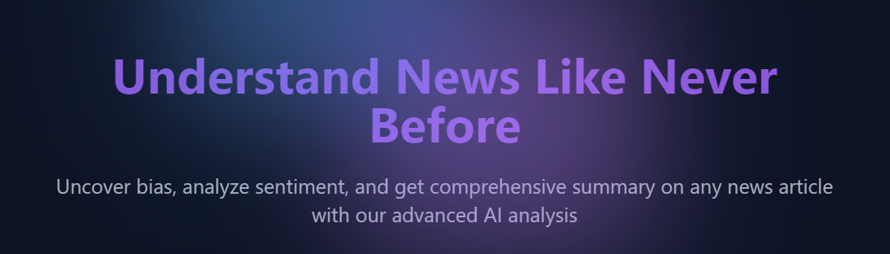
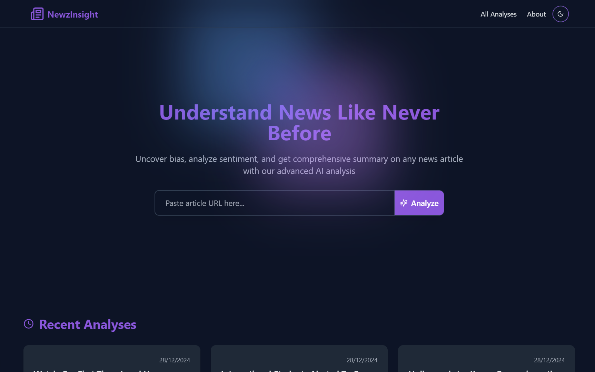
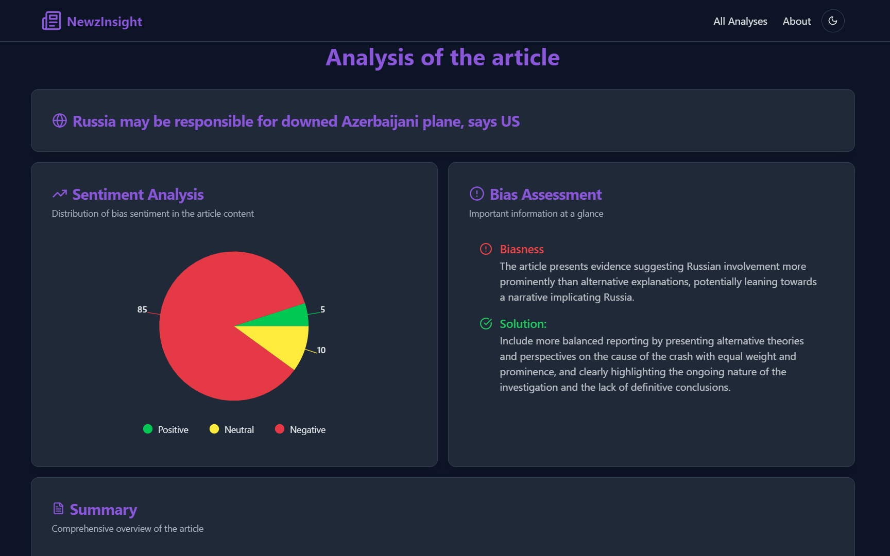

# 

# NewzInsight AI

Welcome to **NewzInsight AI**, your go-to platform for analyzing news articles' sentiment and detecting potential bias! With NewzInsight, you can:

- **Gauge Sentiment**: Quickly understand whether a news article carries positive, negative, or neutral tones.
- **Spot Bias**: Detect possible bias in the content and gain insights into its perspective.
---

## 🚀 Features

- **Sentiment Analysis**: Uses AI to evaluate the emotional tone of articles.
- **Bias Detection**: Highlights linguistic patterns that may indicate bias.
- **Intuitive Interface**: A clean and user-friendly interface powered by [Shadcn/ui
](https://ui.shadcn.com/).
- **Fast and Reliable**: Built with modern web technologies like React and Next.js for smooth performance.
- **API Integration**: Supports fetching articles directly from URLs.

---

## 🛠️ Tech Stack

- **Frontend**: React, Next.js, Tailwind CSS
- **AI Services**: Google Gemini for sentiment and bias analysis
- **Database**: PostgreSQL for storing analysis history

---

## 🌟 Installation

Follow these steps to set up and run NewzInsight locally:

### Prerequisites
- Node.js and npm installed on your machine
- PostgreSQL instance running locally or in the cloud

### Steps
1. **Clone the repository**:
   ```bash
   git clone https://github.com/rahul4019/NewzInsight-AI
   cd NewzInsight-AI
   ```
2. **Install dependencies**:
   ```bash
   npm install
   ```
3. **Set up environment variables**:
   Create a `.env` file in the root directory and add the following:
   ```env
   DATABASE_URL=your-postgres-connection-string
   GEMINI_API_KEY=your-google-gemini-api-key
   NEXT_PUBLIC_BASE_URL=http://localhost:3000
   ```
4. **Start the development server**:
   ```bash
   npm run dev
   ```
5. Open your browser and navigate to `http://localhost:3000`.

---

## 🎨 Screenshots





---


## 🤝 Contributing

Contributions are welcome! If you have suggestions, ideas, or want to fix bugs, feel free to:

1. Fork the repository.
2. Create a new branch (`feature/new-feature`).
3. Commit your changes.
4. Push to your branch and create a Pull Request.

---

## 📧 Contact

Have questions or feedback? Reach out at [rahulkashyap4019@gmail.com](mailto:rahulkashyap4019@gmail.com).

---

Thank you for checking out NewzInsight! Stay informed, stay unbiased. 🌟
